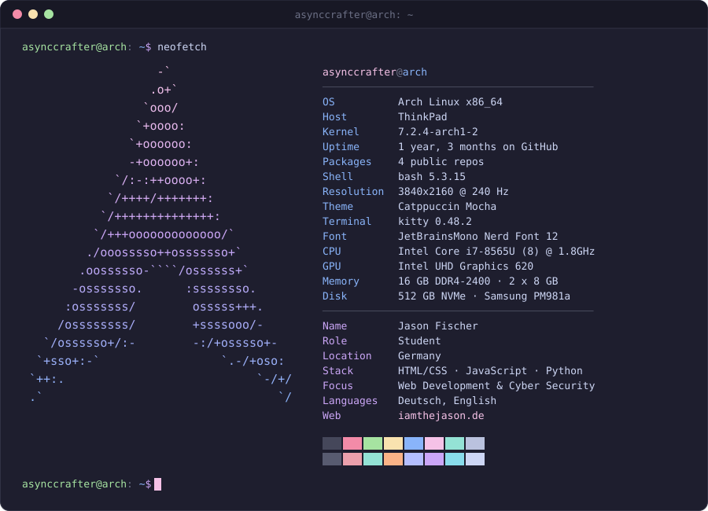

<!--
  ============================================================================
  PROFILE README - asynccrafter/asynccrafter
  ============================================================================
  Die PC-Specs stehen NICHT hier, sondern in  assets/neofetch.svg

  Noch offen (nur du weisst das):
    - [ LANG ]        ... was du gerade lernst
    - [ EMAIL ]       ... oder die Zeile loeschen
    - [ SOCIAL ]      ... oder die zwei Zeilen loeschen
    - about.txt       ... Entwurf, ueberschreib ihn mit deinen Worten
  ============================================================================
-->

<p align="center">
  
</p>

---

### `❯ cat about.txt`

```console
Hi, I'm Jason - a student who builds small, fast things for the web
and spends the rest of his time taking them apart again.

Mostly vanilla HTML, CSS and JavaScript: no framework unless it earns
its place. Python for cyber security. Right now that means
iamthejason.de, a handful of browser tools, and getting properly good
at the security side of the web.

More about me → iamthejason.de
```

### `❯ ls -lh ~/projects`

<pre>
total 4
drwxr-xr-x  jason  <a href="https://github.com/asynccrafter/iamthejason.de">iamthejason.de</a>
drwxr-xr-x  jason  <a href="https://github.com/asynccrafter/Passwordgenerator">Passwordgenerator</a>
drwxr-xr-x  jason  <a href="https://github.com/asynccrafter/To-Do-List">To-Do-List</a>
drwxr-xr-x  jason  <a href="https://github.com/asynccrafter/asynccrafter">asynccrafter</a>
</pre>

### `❯ cat ~/.config/stack.toml`

```toml
[languages]
daily    = [ "HTML", "CSS", "JavaScript", ]
learning = [ "Python" ]

[focus]
areas    = [ "Web Development", "Cyber Security" ]

[tools]
os       = [ "Arch Linux", "Ubuntu", "macOS", "Windows"]
terminal = ["kitty", "zsh"]
```

### `❯ ./contact.sh`

<pre>
→ web ......... <a href="https://iamthejason.de">iamthejason.de</a>
→ github ...... <a href="https://github.com/asynccrafter">@asynccrafter</a>
→ mail ........ <a href="mailto:kontakt@iamthejason.de">kontakt@iamthejason.de</a>
→ instagram ... <a href="https://www.instagram.com/asynccrafter.de">asynccrafter.de</a>
→ x ........... <a href="https://x.com/asynccrafterde">@asynccrafterde</a>
</pre>